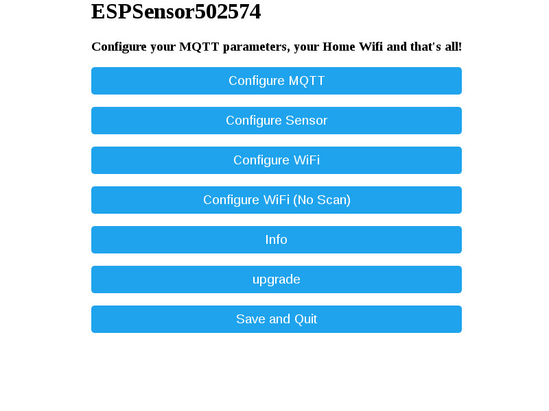

# ESP8266-12E

**2 modes:**

1.  **Normal mode** : The module send every X secondes[1], temperature, humidity and voltage battery[2] through MQTT.
2.  **Configuration mode** :By pulling down GPIO13, the module starts in Wifi acces point mode (reachable @ 192.168.4.1) and provide a web page which allows:
  * configure MQTT IP brocker
  * Set the frequency of sending information from DHT22 sensor in secondes  
  * Configure the WIFI
  * OTA upgrade  
  * Get Info about ESP

[1] sleep mode: After you tell the ESP8266 to sleep, it’ll wait a specified number of microseconds, then trigger the XPD(GPIO16) pin to toggle the reset line(RST). When the ESP8266 wakes up, it’ll begin back at the start of the sketch.

[2] ADC Pin: ESP8266EX also integrates a generic purpose 10-bit analog ADC. The ADC range is from 0V to 1.0V. It is typically used to measure the voltages from the sensor or battery status. The ADC cannot be used when the chip is transmitting. Otherwise the voltage may be inaccurate. (From Expressif datasheet CH 8.5)

### ESP8266-12E

Framework used: Arduino

IDE used:
[PlatformIO Core](http://platformio.org/get-started/cli)

For the first upload you need upload the code through the serial port:
(GPIO0 -> GND , see wiring_ESP file)
```bash
sudo platformio run --target upload
```
Build and upgrade command:
``` bash
platformio run 
```
Then go to upgrade page and select .pioenvs/nodemcuv2/firmware.bin file.


